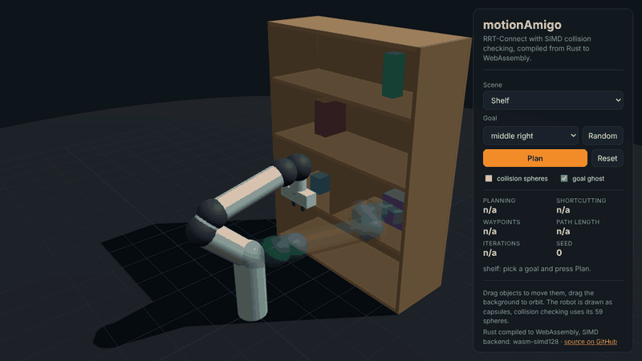
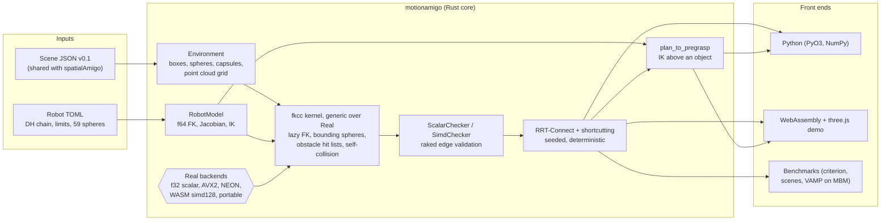

# motionAmigo

**A fast, SIMD-vectorized sampling-based motion planner for robot arms, written in Rust, with Python bindings and a live browser demo.**



*The browser demo: Rust compiled to WebAssembly with SIMD, planning into the shelf compartments in
about 0.2 to 2 ms. Recorded headlessly with Playwright (`web/tools/record.mjs`).*

motionAmigo plans collision-free motions for a Franka Emika Panda (7 DoF) with RRT-Connect and
shortcutting. Following [VAMP](https://github.com/KavrakiLab/vamp) (Thomason, Kingston, Kavraki,
ICRA 2024), the robot is approximated by spheres, and forward kinematics plus collision checking run
on eight configurations along an edge at once with SIMD instructions. motionAmigo is an independent
Rust implementation of these ideas, not a port of the VAMP code.

* Median RRT-Connect planning time of 119 µs on the 699 MotionBenchMaker Panda problems, close to
  VAMP's 88 to 115 µs on the same machine ([numbers below](#benchmarks)). The AVX2 checker is 4.8x
  faster per configuration than the scalar reference.
* One generic kernel for all backends: scalar reference, AVX2 (runtime dispatch), NEON, WebAssembly
  SIMD and a portable fallback. All of them produce **bit-identical** results, so a seed gives the
  same plan on every platform.
* Shares its scene format with the sister project **spatialAmigo**, which turns language such as
  "the mug left of the laptop" into a target object.

## Quickstart

### Python

Requires Rust (stable) and [uv](https://docs.astral.sh/uv/). The package is not on PyPI yet, so it
is built from source:

```bash
git clone https://github.com/Amerigo2020/motionAmigo && cd motionAmigo/crates/motionamigo-py
uv sync                                  # dev tools: maturin, pytest, numpy
uv run maturin develop --release --uv    # builds and installs the extension
uv run pytest                            # runs the Python test suite
uv run python ../../examples/python/plan_tabletop.py
```

```python
import numpy as np
import motionamigo as ma

robot = ma.Robot.panda()
env = ma.Environment.from_scene("../../examples/scenes/tabletop.json")  # path, JSON or dict
planner = ma.Planner(robot, env)                                   # SIMD checker, best backend

goal = np.array([0.06, 0.41, -1.16, -1.02, 0.55, 1.36, 0.52])      # hand above mug_1
result = planner.plan(ma.PANDA_READY, goal, seed=0)
print(result)                     # PlanResult(waypoints=2, length=2.232, planning_time=..., ...)
trajectory = result.interpolate(0.05)       # (K, 7) NumPy array, at most 0.05 rad apart
print(robot.fk(trajectory[-1])[:3, 3])      # TCP position of the last configuration
print(planner.configs_valid(np.random.uniform(robot.lower_limits, robot.upper_limits, (1000, 7))).mean())
```

Planning releases the GIL, so several planners can run in parallel threads.

### Rust

```toml
[dependencies]
motionamigo = { git = "https://github.com/Amerigo2020/motionAmigo" }
```

```rust
use motionamigo::{plan, Environment, PlanSettings, RobotModel, Scene, PANDA_READY};

let robot = RobotModel::panda();
let scene = Scene::from_path("examples/scenes/tabletop.json")?;
let env = Environment::from_scene(&scene);
let goal = [0.06, 0.41, -1.16, -1.02, 0.55, 1.36, 0.52];
let result = plan(&robot, &env, &PANDA_READY, &goal, &PlanSettings::default())?;
println!("{} waypoints in {:?}", result.path.len(), result.total_time());
```

```bash
cargo run --release -p motionamigo --example plan_tabletop
cargo test --workspace --exclude motionamigo-py
cargo bench -p motionamigo --bench collision
```

### Browser demo

The demo in [`web/`](web/) runs the planner as WebAssembly (with `simd128`) next to a three.js
scene: pick a scene and a goal, press Plan, drag obstacles around and plan again. The robot is drawn
as capsules; the collision spheres can be shown as an overlay.

```bash
web/build.sh                          # needs wasm-pack, optionally wasm-opt >= 116
cd web && python3 -m http.server 8000 # then open http://localhost:8000
```

Once GitHub Pages is enabled for this repository (source "GitHub Actions", plus the repository
variable `PAGES_ENABLED=true` for automatic deploys), `.github/workflows/pages.yml` publishes the
demo at https://amerigo2020.github.io/motionAmigo/.

### From language to motion: pre-grasp above a scene object

spatialAmigo resolves an expression such as "the mug left of the laptop" to an object id in the
shared scene. motionAmigo takes it from there: damped least squares IK finds a collision-free
configuration with the hand 10 cm above the object (pointing down, fingers across the narrower
side, tilted away from the base if the object is near the edge of the workspace), and RRT-Connect
plans the motion.

```python
result = ma.plan_to_pregrasp(robot, "../../examples/scenes/tabletop.json", "mug_2", ma.PANDA_READY)
print(result.pose[:3, 3], result.goal, result.plan.path.shape)
```

```bash
cargo run --release -p motionamigo --example pregrasp -- mug_1   # also checks the final approach
uv run python ../../examples/python/pregrasp.py                  # with a stand-in for spatialAmigo
```

In the browser demo, the goal list offers "above <object>" entries that run the same IK in
WebAssembly.

## Benchmarks

All numbers below were measured on the same machine: a cloud VM with an Intel Xeon @ 2.80 GHz,
2 vCPUs, Linux, single-threaded. This is a noisy, rather slow machine (VAMP's own reference timings
on a Ryzen 9 7950X are about 2.5x faster than what VAMP achieves here); repeated runs varied by
about 15%. Raw data and scripts are in [`bench/`](bench/).

### Comparison with VAMP (MotionBenchMaker, Panda, 699 problems)

VAMP 0.6.4 from PyPI (compiled with `-O3 -march=native`), default RRT-Connect settings, one trial
per problem, same problems, obstacles, joint limits and edge resolution for both planners. See
[`bench/README.md`](bench/README.md) for the fairness notes.

| planner | success | planning median | planning P95 | simplification median | total median | total P95 | path length median |
|---|---:|---:|---:|---:|---:|---:|---:|
| VAMP, default (dynamic domain) | 100% | 115 µs | 1.03 ms | 208 µs | 348 µs | 1.47 ms | 4.90 rad |
| VAMP, dynamic domain off | 100% | 88 µs | 1.41 ms | 208 µs | 315 µs | 1.89 ms | 4.84 rad |
| **motionAmigo, AVX2** | 100% | 119 µs | 1.54 ms | 428 µs | 589 µs | 2.20 ms | 4.82 rad |
| motionAmigo, AVX2, greedy shortcutting only | 100% | 118 µs | 1.50 ms | 48 µs | 174 µs | 1.61 ms | 5.44 rad |
| motionAmigo, scalar reference | 100% | 584 µs | 5.66 ms | 2.33 ms | 3.08 ms | 9.01 ms | 4.82 rad |

In short: RRT-Connect planning time is on par with VAMP (VAMP is up to 1.35x faster at the median,
depending on its settings, and has a lower P95). motionAmigo's default shortcutting spends about 2x
more time than VAMP's simplification for slightly shorter paths; with greedy shortcutting only it is
faster than VAMP's, but leaves longer paths. Per-scenario tables:
[`bench/results/mbm-comparison.md`](bench/results/mbm-comparison.md).

### Scalar reference against SIMD (criterion)

Tabletop scene, Panda with 59 spheres, `cargo bench -p motionamigo --bench collision`:

| benchmark | scalar | SIMD portable | SIMD AVX2 | AVX2 speedup |
|---|---:|---:|---:|---:|
| collision-free configuration (FK + collision check) | 1.13 µs | 754 ns | 236 ns | 4.8x |
| edge between two random valid configurations | 120 µs | 69 µs | 18.2 µs | 6.6x |
| planning problem (RRT-Connect + shortcutting) | 2.78 ms | 1.61 ms | 0.48 ms | 5.8x |

### Own scenes (tabletop, shelf, cage)

100 problems per scene (start and goal in different regions, for example two shelf compartments or
inside and outside the cage; problems a straight line solves are excluded), 10 seeds each:

| scene | runs | success | median total | P95 total | median planning | median path length |
|---|---:|---:|---:|---:|---:|---:|
| tabletop | 1000 | 100% | 356 µs | 653 µs | 40 µs | 4.96 rad |
| shelf | 1000 | 100% | 784 µs | 1.56 ms | 131 µs | 6.77 rad |
| cage | 1000 | 100% | 2.57 ms | 21.8 ms | 1.80 ms | 8.09 rad |

With the scalar checker the median totals are 1.90 ms, 4.43 ms and 8.42 ms.

## How it works



1. **Robot model.** The Panda's kinematics come from Franka's modified DH table; its collision
   geometry is 59 spheres in 11 links (from VAMP's spherized URDF), with a bounding sphere per link.
2. **One kernel, many lane types.** Forward kinematics and collision checks are written once against
   a small `Real` trait. With `f32` the kernel checks one configuration; with an eight-lane type it
   checks eight configurations in structure-of-arrays layout. Only exactly rounded operations are
   used (no FMA, compare plus select for min and max), so every backend computes bit-identical
   results, which the equivalence tests verify.
3. **Lazy, hierarchical checking.** Link frames are computed only when needed. A link's bounding
   sphere is tested first and records which obstacles it touches; only those are tested against the
   link's spheres. Self-collision uses three levels (bounding spheres, sphere against bounding
   sphere, sphere pairs). Any colliding lane ends the check.
4. **Raked edges.** An edge is split into `8 * n` configurations; the eight lanes start spread evenly
   along the edge and step backwards together, so a blocked edge is usually rejected in the first
   pass. Edge points are interpolated from both ends, so checking `a -> b` and `b -> a` tests the same
   configurations.
5. **Planner.** Balanced RRT-Connect with VAMP's Panda defaults, then greedy and randomized partial
   shortcutting. A portable xoshiro256** generator makes every plan reproducible from its seed.

## Project layout

| path | content |
|---|---|
| `crates/motionamigo` | core library: robot model, kinematics, SIMD backends, collision checking, planner, IK |
| `crates/motionamigo-py` | Python bindings (PyO3, maturin, uv), tests in `tests/` |
| `crates/motionamigo-wasm` | WebAssembly bindings for the demo |
| `web/` | three.js demo, build script, headless Playwright tools |
| `bench/` | benchmark runner, committed problems, VAMP comparison scripts, results |
| `examples/` | scenes in the shared format, Python examples (Rust examples live in the core crate) |
| `schema/` | JSON Schema of the scene format |
| `docs/decisions.md` | design decisions and their rationale |
| `tools/` | generator of the Panda robot description |

## Limitations

* **Only the Panda is bundled.** The robot format supports any serial chain with revolute joints in
  (modified) DH convention, but a second robot (for example a UR5) needs its sphere model first.
* **The gripper is fixed** at the MotionBenchMaker opening and there are no attached objects, so
  carrying a grasped object is not modeled yet.
* **Collision checking is discrete** along edges (32 checks per radian, like VAMP), not continuous.
  Thin obstacles between two checked configurations can be missed; the sphere model is
  conservative, which mitigates this.
* **Single-query planning only:** no PRM or asymptotically optimal planner, no trajectory
  timing (velocities, accelerations), no constrained or Cartesian motions. The final approach of a
  grasp is only checked as a straight joint-space motion.
* **Nearest neighbours by linear scan.** Fast for the tree sizes of these benchmarks; very large
  trees would profit from a kd-tree or GNAT.
* **Point clouds** use a uniform grid; VAMP's CAPT structure is faster for large clouds.
* **VAMP is still faster** at the 95th percentile and in path simplification; see the benchmarks.
* **Not published** on crates.io, PyPI or npm yet.

## Roadmap

* **Coupling with spatialAmigo:** read its resolved target object directly and expose the chain
  "instruction in, trajectory out" as one Python call and in the browser demo.
* **Grasping:** attached objects (spheres for the held object), gripper width as a parameter,
  Cartesian approach and retreat motions.
* **More robots:** UR5 and a robot description importer from URDF plus sphere decomposition.
* **Faster planning:** kd-tree or GNAT nearest neighbours, Halton sampling, dynamic-domain
  RRT-Connect, an AVX-512 backend with 16 lanes, multi-threaded batch planning.
* **Better paths:** B-spline smoothing and time parameterization.
* **Perception:** CAPT-style point cloud structure and depth image input.

## Citation

motionAmigo implements ideas from VAMP. If you use it in academic work, please cite VAMP:

```bibtex
@inproceedings{vamp_2024,
  title     = {Motions in Microseconds via Vectorized Sampling-Based Planning},
  author    = {Thomason, Wil and Kingston, Zachary and Kavraki, Lydia E.},
  booktitle = {IEEE International Conference on Robotics and Automation (ICRA)},
  year      = {2024},
  url       = {https://arxiv.org/abs/2309.14545},
}
```

The Panda sphere model is derived from VAMP's resources (Apache-2.0) and robowflex_resources (MIT);
the MotionBenchMaker problems used in the comparison are downloaded from the VAMP repository at
benchmark time. See [NOTICE](NOTICE).

## Scene format

motionAmigo shares its scene format with spatialAmigo. Together they form the chain
language, target object, collision-free motion.

* Schema: [`schema/scene-v0.1.json`](schema/scene-v0.1.json)
* Examples: [`examples/scenes/`](examples/scenes/) (tabletop, shelf, cage)

Units are meters, z points up, the frame is right-handed. Each object is an oriented box with a
`center`, full edge lengths `size` and a `yaw` angle about z. The optional `front` and
`viewpoint` fields are used by spatialAmigo and ignored by the planner.

## License

Licensed under either of [Apache License, Version 2.0](LICENSE-APACHE) or [MIT license](LICENSE-MIT)
at your option. See [NOTICE](NOTICE) for third-party data.
